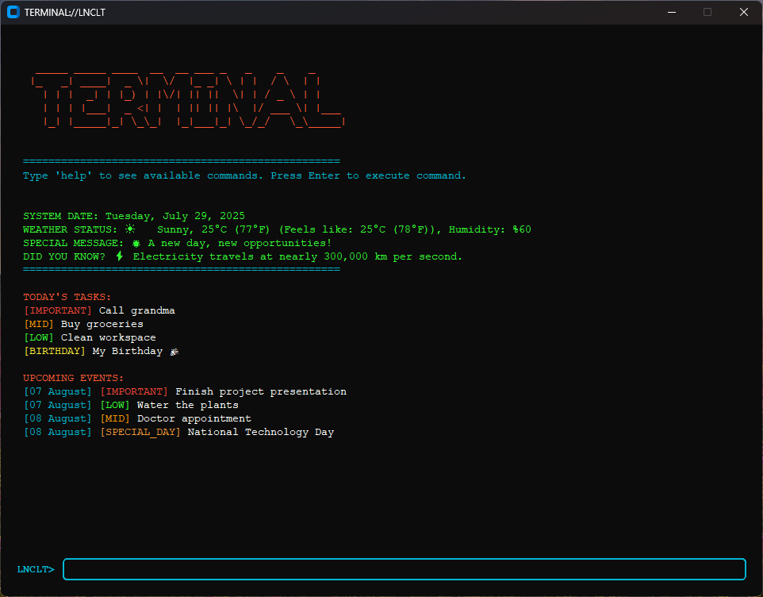

# Daily Notes Terminal

A terminal-inspired daily dashboard that automatically appears when your computer starts.  
It displays your notes, weather updates, and upcoming reminders — all in a clean, retro terminal interface.

---



## ✨ Features

- 📝 Shows today’s notes from `notes.json`
- 🔖 Tag notes as `important`, `mid`, `low`, `special_day`, or `birthday`
- 📅 Displays upcoming reminders (e.g., birthdays, deadlines)
- 🌦 Real-time weather with emoji, humidity, and feels-like temperature (OpenWeather API)
- 📆 Detects national holidays and special dates
- 💻 Retro ASCII-style terminal UI
- ⚙️ Supports autostart on Windows
- 🔌 Works offline except for weather updates

> Built for productivity lovers, developers, and retro terminal enthusiasts.

---

## 🛠️ Installation & Running

> This is a Python-based app (source code only, no `.exe` provided).

### Requirements

- Python 3.9+
- `customtkinter`, `requests`

### Setup

1. **Install Python** from [python.org](https://www.python.org/downloads/)  
   ✅ Check "Add Python to PATH" during installation  
   🔄 Restart your PC after install  
   🧪 Verify:  
   ```bash
   python --version
   ```

2. **Download & Extract** the project ZIP from GitHub.

3. **Open CMD or PowerShell** in the project folder:  
   `Shift + Right Click` → "Open PowerShell here"  
   or type `cmd` in address bar.

4. **Install dependencies**  
   ```bash
   pip install -r requirements.txt
   ```

   or manually:  
   ```bash
   pip install customtkinter requests
   ```

5. **Run the app**  
   ```bash
   python main.py
   ```

---

## 🪄 Auto Start on Boot (Windows)

To launch the app on startup:

1. ✅ Convert `main.py` to `.exe` using [PyInstaller](#how-to-convert-mainpy-to-exe-using-pyinstaller)
2. 📁 Place `notes.json` next to the `.exe`
3. 📌 Create a shortcut of the `.exe`
4. 🪟 Open Startup folder:
   ```
   C:\Users\YOUR_USERNAME\AppData\Roaming\Microsoft\Windows\Start Menu\Programs\Startup
   ```
   or press `Win + R` → `shell:startup`
5. 📥 Paste the shortcut inside
6. 🚀 Done! It will now auto-run on every boot 🎉


## 🧪 How to Convert `main.py` to `.exe` Using PyInstaller

1. Install PyInstaller  
   ```bash
   pip install pyinstaller
   ```

2. Navigate to your project folder  
   ```bash
   cd path\to\your\project
   ```

3. Convert script  
   ```bash
   pyinstaller --onefile --noconsole main.py
   ```

4. Find your `.exe` in the `dist` folder.

5. Place `notes.json` next to the `.exe`.

---

## 📂 `notes.json` Format

```json
"29-07": [
  { "text": "Call grandma", "tag": "important" },
  { "text": "Buy groceries", "tag": "mid" },
  { "text": "Clean workspace", "tag": "low" },
  { "text": "My Birthday 🎉", "tag": "birthday" }
],
"08-08": [
  { "text": "Doctor appointment", "tag": "mid" },
  { "text": "National Tech Day", "tag": "special_day" }
]
```

### Available Tags

| Tag          | Description             |
|--------------|-------------------------|
| `important`  | 🔴 High priority         |
| `mid`        | 🟠 Medium priority       |
| `low`        | 🟢 Low priority          |
| `special_day`| 🎉 Official/personal day |
| `birthday`   | 🎂 Birthdays             |

## 🌤 Weather Setup

1. Get API key from [openweathermap.org](https://openweathermap.org/)
2. Replace this in code:
```python
api_key = "YOUR_API_KEY"
city = "YourCity,CountryCode"
```

Displays:
- Emoji-based condition
- Temperature
- Feels like
- Humidity


## 🧾 Terminal Header (ASCII Example)

```
  _____ _____ ____  __  __ ___ _   _    _    _     
 |_   _| ____|  _ \|  \/  |_ _| \ | |  / \  | |    
   | | |  _| | |_) | |\/| || ||  \| | / _ \ | |    
   | | | |___|  _ <| |  | || || |\  |/ ___ \| |___ 
   |_| |_____|_| \_\_|  |_|___|_| \_/_/   \_\_____|
```

---

## 📄 License

MIT — free for personal or commercial use.


**Contributions welcome!**